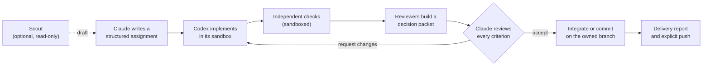

# Codex Team for Claude Code

**Claude leads. Codex codes. Nothing is accepted without evidence.**

[](LICENSE)


Codex Team turns [Claude Code](https://code.claude.com/docs) into a tech lead that delegates implementation to the [OpenAI Codex CLI](https://github.com/openai/codex). Claude turns your request into a structured assignment, and Codex writes the code and tests in its sandbox. The plugin then verifies, reviews and records every step independently before Claude is allowed to accept the work.

```text
/codex-team:lead Add rate limiting to the public API
```

Claude's context stays on design, review and judgment, and Codex does the typing. Acceptance rests on recorded evidence, never on a worker saying "done".

## Highlights

- **Evidence-gated acceptance.** Work moves through `implementation_finished → verified → accepted`. A zero exit code or a worker's "all tests pass" never counts as acceptance.
- **Independent, sandboxed verification.** Checks run in the Codex sandbox with network off and an exact environment allowlist. Running anything on the host needs an acknowledgment tied to the exact reviewed content.
- **Decision packets with real code review.** A separate reviewer thread plus a native first pass produce severity- and confidence-ranked findings with file and line citations. Serious findings block acceptance until Claude records a decision on each.
- **Twelve-component project policy.** Owned branches, file ownership, coverage gates, secret scanning, budgets, delivery reports and more. Each is switchable between off, advise and enforce, and every profile is approved by its exact hash.
- **Parallel workers.** Isolated child worktrees with disjoint scopes are integrated one at a time. Integration stops at the first conflict, and the combined result is verified again.
- **Built for long, messy sessions.** A shared crash-safe job database serves every session on the machine. The plugin retries transient failures, salvages work at the deadline, learns timeouts from past runs, and restores Claude's working state after `/compact` or `/clear`.
- **Honest accounting.** After each task, a footer shows who wrote the output, who authored the code, what it consumed and (with your prices) what it cost.
- **Zero runtime dependencies.** Plain Node.js 24 with its built-in SQLite: about 12,000 lines of code and 400+ tests that run against a fake Codex, with no model usage.

## How a job flows



While Codex works, Claude runs a background waiter that wakes it only on a phase change, a decision, a failure, a stall or a heartbeat. Nothing polls in a loop.

## Features

### Evidence-based acceptance

- **Structured assignments**: objective, literal scope, constraints, decisions, dependencies, acceptance criteria and verification commands. Commands are argument arrays, never shell strings.
- **Every criterion needs evidence.** Acceptance is refused when a criterion has no evidence, the worker reported a blocker, or any verified file changed afterwards. Content fingerprints catch every later edit.
- **Scope tracking.** File snapshots capture your existing local changes as the baseline and detect anything Codex touched outside its scope.
- **Idempotent requests.** Stable `requestId`s deduplicate retries, even across separate MCP server processes.
- **Isolation on demand.** Use `direct` mode to work alongside your uncommitted changes, or detached worktrees that leave your checkout untouched until reviewed changes are integrated.

### Sandboxed, independent verification

- Checks run in the Codex sandbox with `workspace-write`, network access disabled and private temp folders. Each check gets only core OS variables plus the names it explicitly passes, and `PYTHONSAFEPATH=1` is set.
- **Auto-verify** runs automatically for checks Claude wrote. Commands drafted by a scout never run automatically.
- **Host execution is opt-in per check.** Claude must first inspect the diff, the hidden-changes list and the Git configuration, then supply the current `reviewFingerprint`. The acknowledgment is re-checked right before each run, and host checks never run automatically.
- **Real test parsing.** Test counts and per-file LCOV coverage are read from the actual output. Unknown counts stay unknown, never zero.

### Decision packets and independent review

- Every verification ends in a **decision packet**: check results, criterion verdicts, risks and exact hunks against the captured baseline bytes, plus omission counts and worker blockers. It is capped at 6,000 characters, with the full artifact on disk.
- **Two layers of review:** a separate Codex reviewer thread plus a native, read-only first pass. `mode: "adversarial"` asks for threat-model reviews across up to ten focus areas. Large diffs are split across up to four reviewers that each cover different files.
- **Ranked, cited findings.** Critical and high findings need an explicit decision before acceptance: `not-a-defect`, `accepted-risk` or `fixed`.
- **Evidence floors.** Reviewers and scouts must show they actually read the files they cite. Listings, counts and printed commands don't count.
- **Prompt-injection guard.** If `AGENTS.md`, `AGENTS.override.md` or `.codex/` configuration changed during a job, even in ignored files, reviewers, automatic resumes and deadline finalizers refuse to launch.

### Scouts and the project handbook

- **Scouts** (`mode: "scout"`) explore read-only and return a structured brief: literal files, line ranges, data flow, risks, open questions and a draft assignment with 1 to 20 verification commands. The draft is hash-bound, so Claude confirms exactly what it inspected.
- **Project handbook.** Versioned knowledge of up to 16,000 characters is injected into every assignment as reference data. Notes Codex suggests are only proposals until Claude selects them at acceptance.

### Project profiles: twelve policy components

Projects opt in with `.codex-team/profile.json`. Each component is `off`, `advise` or `enforce`, approved by exact hash. Local overrides can only tighten policy, and built-in `standard` and `strict` templates are included.

| Component | What it governs |
| --- | --- |
| `branchMode` | Owned branches and worktrees, commits of accepted paths only, explicit push rules and denied branches |
| `ownership` | File and lane ownership, including uncommitted and untracked changes, append-only files and project checker scripts |
| `gates` | Project checks, affected-test selection by name maps and import graph, coverage minimums, one isolated retry for genuine timeouts |
| `context` | Documentation packs per lane, conventions and decisions that need the owner |
| `criteria` | Reusable acceptance-criteria templates suggested by changed paths |
| `report` | Delivery reports with an owner summary, target-file insertion and timezone |
| `parallel` | Parallel worker limits, shared-file preparation and sequential integration |
| `leadEvidence` | Required browser observations (tool, URL, viewports, console errors) or owner-decision quotes for tagged criteria |
| `secrets` | Forbidden paths and secret patterns scanned in diffs, logs, reports and commit messages, with redaction as text is stored |
| `budget` | Budgets on observed usage that stop or cancel cleanly |
| `textHygiene` | Line endings, encoding, BOM and final newline |
| `continuity` | Branch-keyed lead context and handoff export/import that never imports authority |

See the [profile guide](docs/PROFILE-GUIDE.md), the [JSON schema](schemas/profile.schema.json) and a [minimal Node example](examples/node/profile.json).

### Parallel batches and branch delivery

- **`codex_batch`** starts explicitly authorized children with disjoint scopes in isolated worktrees. Each child is reviewed and accepted on its own, integration stops at the first conflict, and the combined result needs its own verification.
- **Branch mode** commits accepted code on the recorded owned branch, and the delivery report gets its own commit.
- **`codex_push`** pushes only the permitted own branch at an exact expected commit. There is no implicit force, tagging, merging to the main branch or deployment.

### Built to survive real work

- **One shared job database.** Every Claude session and Codex run on the machine uses the same SQLite database. Locks are held for milliseconds, a busy database never fails a run, and each project reserves its single active job atomically.
- **Bounded automatic recovery.** A supervisor retries proven transient failures (disconnects, 429s, 5xx errors) at most twice on the same thread, waiting longer each time. Sandbox failures, denials, budgets and secrets are never replayed.
- **Deadline salvage.** On timeout, the same thread is resumed once, read-only and without tools, to return a structured report instead of losing the work.
- **Learned timeouts.** After five finished runs, new jobs use 1.5× the 90th-percentile duration for their kind, between 10 minutes and 2 hours.
- **Stall and orphan handling.** The waiter reports stalls without stopping the job. Dead workers are detected, and a live orphan process blocks replacement instead of being killed blindly.
- **Stateless lead.** A recovery card of up to 8,000 characters (active jobs, wait commands, decisions and next steps) is re-injected after `/compact`, `/clear` or a resume.

### Context economy

- Compact tool output by default, with capped packets and `detail: "full"` when evidence is needed.
- A background waiter (`run_in_background`) instead of polling, with optional 30-minute heartbeats.
- A **live status line** with zero model calls: phase, current step and live tokens for each job.
- A context meter in the footer with a **break-even reset advisor**. It suggests `/compact` or `/clear` only when the math says it saves tokens, and only you run them.

### Accounting you can trust

After each task, a Stop hook prints the split between Claude (the lead) and Codex:

```text
╭─ Last task · output ██████████▌░░░░░ lead 20 · Codex 10
│ Code: Codex +4/-2 in 1 files · lead +0/-0 in 0 files
│ Consumption: lead 120 · Codex 60 tokens (price gap; no dollar total)
│ Re-reads: lead 20 · Codex 10
│ Session: output lead 20 (67%) · Codex 10 (33%); consumption 120 / 60
│ Lead shell edits are not visible; ? = unknown lines/files.
```

- Codex work is credited by the job IDs that appear in this session's MCP results, including subagents, across project folders.
- Dollar totals appear only when your own `prices.json` covers every model and rate. There are no guessed prices.
- `node scripts/stats.mjs` reports 50th- and 90th-percentile durations, token medians, and timeout and salvage rates per job kind.
- A **delegation guard** (`PreToolUse`) gently stops Claude from hand-writing large source changes after it has delegated to Codex. It can be set to `remind`, `block` or `off`.

### Security hardening

- Everything Codex writes (progress, reports, reviewer findings, hunks, handbook notes) is wrapped and labeled as **untrusted data**, and control characters are stripped from command and hook output.
- **No bypass flags.** No sandbox, approval, rules or hook-trust bypass is ever used. Workers run with `approval_policy=never` and fail instead of waiting invisibly for an escalation.
- Git calls disable fsmonitor, hooks and clean/smudge filters. Changes to Git configuration, attributes or hooks require a fresh host acknowledgment.
- With the `secrets` component, matching text is redacted as it is stored: stdout, stderr, results and job state.
- Slash-command arguments never reach a shell, and job-ID prefixes resolve only to a unique match.

### Windows sandbox diagnostics

- **`codex_doctor`** reports the actual executable selected, login state, sandbox readiness and past log findings. An optional bounded probe (no model call) tests command execution, write containment and the environment, plus the network if you ask.
- It tells apart a runtime read/execute failure, a project-folder permission failure and a `.git` protection failure.
- It detects project folders owned by an account from a previous Windows installation and prints the exact administrator `takeown` command. It never runs that command itself.
- A failed sandbox marks the job `blocked_runtime` and stops further model calls in that project until a probe passes.

### Zero-token slash commands

`/codex-team:status`, `/codex-team:result`, `/codex-team:cancel` and `/codex-team:stats` work out of the box. With the opt-in `UserPromptSubmit` hook, they answer **without a model turn**, at no token cost.

## Tools

| Tool | Purpose |
| --- | --- |
| `codex_doctor` | Diagnose the CLI and sandbox readiness; optional bounded probe without a model call |
| `codex_start` | Start, revise or resume an assignment, or run a read-only scout |
| `codex_status` | Inspect or recover jobs, evidence and fingerprints |
| `codex_cancel` | Request cancellation; status confirms it |
| `codex_context` | Read or update lead decisions and the project handbook, with version checks |
| `codex_verify` | Run declared checks in the sandbox; host checks need a fingerprint-bound acknowledgment |
| `codex_review` | Record findings, request revisions or accept verified work |
| `codex_integrate` | Apply accepted worktree changes, or commit them on the owned branch |
| `codex_profile` | Read, validate, explain and approve a project policy |
| `codex_report` | Render recorded evidence and write the reviewed delivery report |
| `codex_batch` | Start authorized isolated children and integrate and verify their union |
| `codex_push` | Push only the permitted own branch at an exact commit |
| `codex_hygiene` | Check or restore known text formatting, then require new verification |
| `codex_handoff` | Export and import branch notes without importing authority |

## Install

Requires **Node.js 24+**, [Claude Code](https://code.claude.com/docs) and the [Codex CLI](https://github.com/openai/codex), both already logged in.

```shell
claude plugin marketplace add https://github.com/lmsutools/codex-team-claude-code-plugin.git
claude plugin install codex-team@lmsutools --scope user
```

Update later with:

```shell
claude plugin marketplace update lmsutools
claude plugin update codex-team@lmsutools
```

Inside a Claude Code session, `/plugin marketplace add https://github.com/lmsutools/codex-team-claude-code-plugin.git` and `/plugin install codex-team@lmsutools` do the same. The short form `lmsutools/codex-team-claude-code-plugin` also works if your Git can reach GitHub over SSH. Restart or reconnect sessions after installing or updating.

Then open Claude Code in a Git project and run `/codex-team:lead <what you want built>`. Claude can also pick up the skill on its own.

## Configuration

Everything works without configuration. Optional settings:

| Setting | Effect |
| --- | --- |
| `CODEX_TEAM_STATE` | Moves the state folder (default `~/.claude/codex-team/jobs`) |
| `CODEX_TEAM_CODEX` | Absolute path to a specific `codex` executable or `codex.js` |
| `CODEX_TEAM_GUARD` | Delegation guard: `remind` (default), `block` or `off` |
| `CODEX_TEAM_TOKENS` | Footer: `long` (default), `always` or `off` |
| `CODEX_TEAM_TOKENS_MIN_CALLS` | Minimum Claude calls before the footer appears (default 8) |
| `CODEX_TEAM_DB_BUSY_MS` | How long a write waits for the shared database (default 60000) |
| `~/.claude/codex-team/prices.json` | Your per-million-token rates, to enable dollar totals |

Plugins can't set Claude Code's status line or every hook themselves, so these stay opt-in: the **status line**, the **zero-token command hook** and an optional **large tool-output warning**. Copy the snippets from the [reference](docs/REFERENCE.md), using the install path that `claude plugin details codex-team` shows.

## What it will not do

- Bypass sandboxes, approvals, rules or hook trust, or weaken them during recovery.
- Merge to your main branch, deploy, create tags or force-push without lease and authorization.
- Run Codex-written code on your host without a fingerprint-bound acknowledgment.
- Install dependencies, rewrite file permissions, or run administrator repairs itself.
- Store new credentials. It uses your existing Claude Code and Codex logins.

Job state, including prompts, reports and logs, lives under `~/.claude/codex-team/` on your machine and can contain project data. The plugin itself uploads nothing; Claude Code and Codex talk to their own services as usual.

## Development

```shell
npm test
```

The suite runs 29 test files and 400+ tests serially against a fake Codex executable, with no model usage, covering lifecycle, protocol, verification, recovery, worktrees, concurrency and security hardening. The full suite takes a while: several tests exercise real timeouts and recovery delays.

| Path | Contents |
| --- | --- |
| `skills/lead/SKILL.md` | The lead workflow Claude follows |
| `scripts/` | MCP server, runtime, supervisor, store, hooks and status line |
| `hooks/hooks.json` | Stop footer, delegation guard and recovery-card hooks |
| `commands/` | Slash-command fallbacks |
| `schemas/`, `templates/`, `examples/` | Profile contract, built-in templates and an example |
| `docs/` | [Reference](docs/REFERENCE.md) (detailed behavior by release) and [profile guide](docs/PROFILE-GUIDE.md) |

## License

[MIT](LICENSE). Codex Team is an independent project and is not affiliated with Anthropic or OpenAI.
